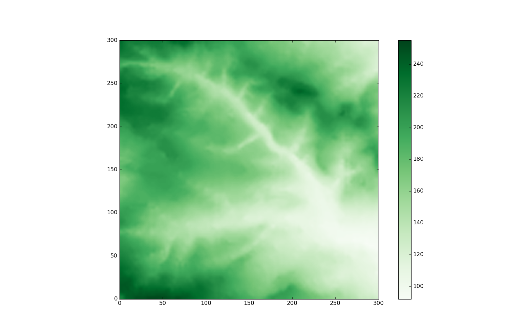

# Programming for Geographical Information Analysis: Core Skills (WUN)
***
## by Rashad A.K. Ahmed

This is a portfolio submitted for assessment as part of the Programming for Geographical Information Analysis: Core Skills module, in the MSc of Geographical Information Science program at the School of Geography, University of Leeds. The portfolio is an agent based model built up throughout the module tutorials. The model build up process can be traced in [this github repo](https://github.com/ra6had/Practical_Portfolio).

The agents represent sheep which have the ability to move in the four cardinal directions based on randomly generated numbers. The sheep can also eat resources (grass) from their environment and share available resources with other sheep in their proximity.


## Model Libraries

First we import the libraries upon which this model depends. 
+ [random](https://docs.python.org/3/library/random.html) for moving agents in psuedo random directions
+ [csv](https://docs.python.org/3/library/csv.html) for reading and writing csv files
+ [numpy](http://www.numpy.org/) utelized by the Agent class to compute the total amount of resources available in its environment
+ [matplotlib.pyplot](https://matplotlib.org/api/_as_gen/matplotlib.pyplot.html) for plotting the agents and the environment
+ [matplotlib.animation](https://matplotlib.org/api/animation_api.html) for animating the plot
+ [pandas](https://pandas.pydata.org/) used to construct DataFrames and write them to csv


```python
import random
import csv
import numpy as np
import matplotlib.pyplot as plt
import matplotlib.animation as animation
import pandas as pd
```

## Creating the Agent Class

After importing the libraries, we move on to creating our Agent class and defining its methods.

The \__init__() method provides the blueprint for instantiating Agents instantiate an agent. It requires two arguments:

1. environment: a 2D list representing the environment
2. agents: a list of all the agents with which the instantiated agent is to share this environment

The agent class has four methods that enable the agent to enteract with its environment and other agents in it.

1. move(steps): this method takes in the argument "steps" which is an integer representing the number of steps to take. The direction of the step is decided by a random number generated for each step
2. eat(amount): this method makes the agent eat a certain amount from its environment 
3. distance_between(agent): this 
4. share_with_neighbours(neighbourhood): this method makes the agent share its store with agents within it "neighbourhood"


```python
class Agent():
	"""
	Create an Agent class.
	Arguments:
	environment -- 2D indexed data representing the environment with which the
                   the agents will interact.
	agents -- a list of agents with which the agent shares the enevironment

    Methods:
    move -- takes in a number of steps and moves agent in random directions.
    eat -- takes in amount and makes the agent eat (consume) that amount from
           its environment if the amount is available at the agent's location.
   """

	def __init__(self, environment, agents):
		self.environment = environment
		self.agents = agents
		self.store = 0
		self.resources = np.sum(self.environment)
		self.y = random.randint(0, len(self.environment))
		self.x = random.randint(0, len(self.environment[0]))

	def __str__(self):
		return "I'm an agent in: (" + str(self.x) + ',' + str(self.y) + ").\
With a store of: " + str(self.store)


	def move(self, steps=10):
		"""Moves the agent a number of steps in random directions

        keyword arguments:
        steps -- an intiger representing the number of steps
        """
		for i in range(steps):

			if random.random() < 0.5:
				self.y = (self.y + 1) % len(self.environment[0])
			else:
				self.y = (self.y - 1) % len(self.environment[0])

			if random.random() > 0.5:
				self.x = (self.x + 1) % len(self.environment)
			else:
				self.x = (self.x - 1) % len(self.environment)


	def eat(self, amount=10):
		"""Make the agents eat a given amount from its environment

        arguments:
        amount -- an intiger representing the amount to eat from the
        environment
        """
		if self.environment[self.y][self.x] > amount:
			self.environment[self.y][self.x] -= amount
			self.store += amount

	def distance_between(self, agent):
	    """
	    compute distances between agent and other agents in its environment.

	    arguments:
	    agent -- an with agent.x and agent.y attributes

		returns distances between self and agent.
	    """
	    return abs(((self.y - agent.y)**2 + ((self.x - agent.x))**0.5))

	def share_with_neighbours(self, neighbourhood=10):
		"""
        Share store with neighbouring agents.

		arguments:
		neighbourhood -- a number representing the neighbourhood
						 radius around the agent.
	    """
		self.neighbourhood = neighbourhood
		for agent in self.agents:
			# Do not share with self
			if self.agents.index(agent) != self.agents.index(self):
				# Only share with proximate agents
				if self.distance_between(agent) <= self.neighbourhood:
					sum_store = self.store + agent.store
					average = sum_store/2
					self.store = average
					agent.store = average
```

## Defining the Update Function

The update funcation is called by the FuncAnimation constructor at every frame and it defines what the agents will do at every iteration. In this case, in every iteration each agent will __move__ a number of __steps__, __eat__ a __bite__, and __share_with_neighbours__ in its __neighbourhood__. The figure is then updated to show these changes.

The update function can best be understood in relation to the FuncAnimation constructor, more on that to follow.


```python
%matplotlib qt

def update(frames):
	"""
	Update the animation frames.

	This function is passed onto animation.FuncAnimation(). It utelizes
	the	global variable "num_of_iterations" to simultaneously iterate through
	the agents making them perform certain methods and update the animation
	frame after each iteration.

	"""
	# Declare the global variables
	global num_of_iterations
	global dataframe

	"""
	The following if statement ensures that the animation and the methods
	are called a definate number of times, i.e. "num_of_iterations"

	Once the iterations are finished, record the final locations and the
	amount of resources in each agents store and finally convert the output
	into a dataframe and write it to a csv file
	"""
	if num_of_iterations > 0:
		fig.clear()
		plt.title('Sheep are busy eating') # Sheep are still eating
		# make each agent move, eat and share
		for agent in agents:
			agent.move(steps)
			agent.eat(bite)
			agent.share_with_neighbours(neighbourhood)
		plt.imshow(environment, origin='lower')
		plt.colorbar()
		plt.xlim(0, len(environment[0]))
		plt.ylim(0, len(environment))
		for i in range(num_of_agents):
			plt.scatter(agents[i].x,agents[i].y)
		num_of_iterations -= 1 # Reduce by one
		print('Another bite, please!') #should be printed num_of_iterations
	else:
		print('baa baa, no more grass please!')
		plt.title('Sheep are done eating')
		dataframe = pd.DataFrame()
		end_location_x = []
		end_location_y = []

		# Record the agents' final location
		for i in range(len(agents)):
			end_location_x.append(agents[i].x)
			end_location_y.append(agents[i].y)

		# Construct a dictionary for each agent then append it to dataframe
		for i in range(len(agents)):
			df = {}
			df['Store'] = agents[i].store
			df['Final Location X'] =  end_location_y[i]
			df['Final Location Y'] =  end_location_y[i]
			df['Initial Location X'] = st_location_x[i]
			df['Initial Location Y'] = st_location_y[i]
			dataframe = dataframe.append(df, ignore_index=True)
		print(dataframe)

		# Write the output dataframe to a csv file
		with open('output.csv', 'w') as datafile:
			dataframe.to_csv(datafile)
```

## Set Model Parameters

In this code block we set the model parameters, the color map with which to display the environment, and the figure size and style.


```python
num_of_agents = 200
num_of_iterations = 100
bite = 20
steps = 10
neighbourhood = 10
fig = plt.figure(figsize=(15, 15))
plt.style.use('classic')
plt.set_cmap('Greens')
```

## Reading the Environment Data

In the following code segment, we read in the envieonment data from a csv file and store it as a list of lists, where each list in environment represents a row of pixels and the values inside the rows represent pixel values. 

Below is an image of the environment before it is altered by the agents.



```python
with open('in.txt', newline='') as f:
    reader = csv.reader(f, quoting=csv.QUOTE_NONNUMERIC)
    # Create and populate the environment variable with data
    #from the csv file just read.
    environment = []
    for line in reader:
        rowlist = []
        for value in line:
            rowlist.append(value)
        environment.append(rowlist)
```

## Instantiating Agents

In the following step, we instantiate Agents and append them to a list based on the "num_of_agents" variable.


```python
agents = []
for i in range(num_of_agents):
    agents.append(Agent(environment, agents))
```

## Getting Initial Agent Properties

The following lines of code iterates through the list of agents and appends each agent's initial x and y coordinates to a corresponding list.


```python
st_location_x = []
st_location_y = []
for agent in agents:
	st_location_x.append(agent.x)
	st_location_y.append(agent.y)
```

# Animate!

Here we construct a [FuncAnimation Class](https://matplotlib.org/api/_as_gen/matplotlib.animation.FuncAnimation.html) from the matplotlib.animation library. The FuncAnimation is instantiated with five arguments in this instance.

* fig = fig: which is defined in the Model Parameters section
* func = update: the update function defined earlier, the FuncAnimation class calls this function at every frame
* frames = num_of_iterations: this argument defines the number of frames in the animation
* interval = 1: defines the delay in miliseconds between frames
* repeat = False: to stop the function from repeating once the sequence of frames is completed

### More on update, frames and FuncAnimation

The FuncAnimation constructor calls the update function at every frame (num_of_iterations), yet everytime update() is called, it alters the num_of_iterations variable. Let us have another look at upadate and how it interacts with frames and FuncAnimation.

update() first checks if num_of_iterations > 0, i.e. if there are frames left to update. If True, it updates the frame. AT the end of each frame update it reduces the num_of_iterations by 1.


    if num_of_iterations > 0:
		fig.clear()
		plt.title('Sheep are busy eating') # Sheep are still eating
		# make each agent move, eat and share
		for agent in agents:
			agent.move(steps)
			agent.eat(bite)
			agent.share_with_neighbours(neighbourhood)
		plt.imshow(environment, origin='lower')
		plt.colorbar()
		plt.xlim(0, len(environment[0]))
		plt.ylim(0, len(environment))
		for i in range(num_of_agents):
			plt.scatter(agents[i].x,agents[i].y)
		num_of_iterations -= 1 # Reduce by one"""

When the frames are finished, i.e. num_of_iterations > 0 returns False, then the function moves on to capture the final state of our agents by getting their final locations and the amount of resources in their store.

    else:
		plt.title('Sheep are done eating')
		dataframe = pd.DataFrame()
		end_location_x = []
		end_location_y = []

		# Record the agents' final location
		for i in range(len(agents)):
			end_location_x.append(agents[i].x)
			end_location_y.append(agents[i].y)

		# Construct a dictionary for each agent then append it to dataframe
		for i in range(len(agents)):
			df = {}
			df['Store'] = agents[i].store
			df['Final Location X'] =  end_location_y[i]
			df['Final Location Y'] =  end_location_y[i]
			df['Initial Location X'] = st_location_x[i]
			df['Initial Location Y'] = st_location_y[i]
			dataframe = dataframe.append(df, ignore_index=True)
		print(dataframe)


```python
ani = animation.FuncAnimation(fig, func=update, frames=num_of_iterations,\
							   interval=1, repeat=False)
plt.show()
```

    Another bite, please!
    Another bite, please!
    Another bite, please!
    Another bite, please!
    Another bite, please!
    Another bite, please!
    Another bite, please!
    Another bite, please!
    Another bite, please!
    Another bite, please!
    Another bite, please!
    Another bite, please!
    Another bite, please!
    Another bite, please!
    Another bite, please!
    Another bite, please!
    Another bite, please!
    Another bite, please!
    Another bite, please!
    Another bite, please!
    Another bite, please!
    Another bite, please!
    Another bite, please!
    Another bite, please!
    Another bite, please!
    Another bite, please!
    Another bite, please!
    Another bite, please!
    Another bite, please!
    Another bite, please!
    Another bite, please!
    Another bite, please!
    Another bite, please!
    Another bite, please!
    Another bite, please!
    Another bite, please!
    Another bite, please!
    Another bite, please!
    Another bite, please!
    Another bite, please!
    Another bite, please!
    Another bite, please!
    Another bite, please!
    Another bite, please!
    Another bite, please!
    Another bite, please!
    Another bite, please!
    Another bite, please!
    Another bite, please!
    Another bite, please!
    Another bite, please!
    Another bite, please!
    Another bite, please!
    Another bite, please!
    Another bite, please!
    Another bite, please!
    Another bite, please!
    Another bite, please!
    Another bite, please!
    Another bite, please!
    Another bite, please!
    Another bite, please!
    Another bite, please!
    Another bite, please!
    Another bite, please!
    Another bite, please!
    Another bite, please!
    Another bite, please!
    Another bite, please!
    Another bite, please!
    Another bite, please!
    Another bite, please!
    Another bite, please!
    Another bite, please!
    Another bite, please!
    Another bite, please!
    Another bite, please!
    Another bite, please!
    Another bite, please!
    Another bite, please!
    Another bite, please!
    Another bite, please!
    Another bite, please!
    Another bite, please!
    Another bite, please!
    Another bite, please!
    Another bite, please!
    Another bite, please!
    Another bite, please!
    Another bite, please!
    Another bite, please!
    Another bite, please!
    Another bite, please!
    Another bite, please!
    Another bite, please!
    Another bite, please!
    Another bite, please!
    Another bite, please!
    Another bite, please!
    Another bite, please!
    baa baa, no more grass please!
         Final Location X  Final Location Y  Initial Location X  \
    0                11.0              11.0                91.0   
    1                 7.0               7.0                 5.0   
    2               122.0             122.0               233.0   
    3               228.0             228.0               171.0   
    4               141.0             141.0               189.0   
    5               275.0             275.0               210.0   
    6               240.0             240.0               195.0   
    7               249.0             249.0               284.0   
    8               207.0             207.0               128.0   
    9               127.0             127.0               277.0   
    10              270.0             270.0                30.0   
    11               38.0              38.0               284.0   
    12              299.0             299.0                89.0   
    13               59.0              59.0                56.0   
    14              144.0             144.0               180.0   
    15               39.0              39.0                91.0   
    16              199.0             199.0               155.0   
    17               64.0              64.0               287.0   
    18              258.0             258.0               273.0   
    19               46.0              46.0                 1.0   
    20              134.0             134.0                48.0   
    21              286.0             286.0                80.0   
    22              210.0             210.0               204.0   
    23              135.0             135.0                60.0   
    24               26.0              26.0               206.0   
    25              190.0             190.0               133.0   
    26              255.0             255.0               106.0   
    27              226.0             226.0               240.0   
    28              287.0             287.0               144.0   
    29              222.0             222.0               220.0   
    ..                ...               ...                 ...   
    170              21.0              21.0                86.0   
    171             168.0             168.0               254.0   
    172             245.0             245.0               199.0   
    173              40.0              40.0               148.0   
    174             167.0             167.0                77.0   
    175              87.0              87.0               176.0   
    176             220.0             220.0                37.0   
    177             162.0             162.0               257.0   
    178             168.0             168.0               195.0   
    179             129.0             129.0               108.0   
    180             111.0             111.0               278.0   
    181             256.0             256.0               107.0   
    182             116.0             116.0               298.0   
    183              54.0              54.0               293.0   
    184             162.0             162.0               276.0   
    185             239.0             239.0               144.0   
    186             293.0             293.0                14.0   
    187             235.0             235.0               145.0   
    188             258.0             258.0               108.0   
    189             101.0             101.0               249.0   
    190             245.0             245.0               262.0   
    191              47.0              47.0               284.0   
    192              74.0              74.0                46.0   
    193             257.0             257.0               237.0   
    194              54.0              54.0                36.0   
    195             128.0             128.0               211.0   
    196             234.0             234.0               166.0   
    197              17.0              17.0                54.0   
    198             102.0             102.0               218.0   
    199             295.0             295.0                98.0   
    
         Initial Location Y        Store  
    0                  11.0  1985.539096  
    1                   7.0  2003.781283  
    2                 106.0  1994.089207  
    3                 220.0  2005.788044  
    4                 179.0  2011.469636  
    5                   5.0  2000.685367  
    6                 220.0  2008.986537  
    7                 285.0  1987.376668  
    8                 163.0  1997.761680  
    9                 109.0  2014.547270  
    10                286.0  2000.180420  
    11                 58.0  1987.923115  
    12                269.0  1990.256296  
    13                 47.0  1996.541327  
    14                118.0  1986.894385  
    15                287.0  2002.761130  
    16                251.0  1982.983316  
    17                 54.0  1988.899235  
    18                238.0  2009.341118  
    19                  6.0  1994.462360  
    20                164.0  1981.548886  
    21                 18.0  1994.309607  
    22                192.0  1992.977077  
    23                147.0  1985.184648  
    24                 40.0  1999.855348  
    25                200.0  1992.258971  
    26                231.0  2006.238618  
    27                166.0  2007.279198  
    28                259.0  1988.749668  
    29                218.0  2010.465300  
    ..                  ...          ...  
    170                51.0  1992.849283  
    171               162.0  1992.192659  
    172               239.0  2007.705064  
    173                44.0  1995.342122  
    174               159.0  2003.848500  
    175               131.0  1998.488360  
    176               240.0  1997.698256  
    177               184.0  2005.159054  
    178               210.0  1992.192659  
    179               159.0  2007.875472  
    180               137.0  2003.112458  
    181               238.0  2000.787131  
    182                84.0  2002.252150  
    183                26.0  1991.087247  
    184               158.0  2005.159054  
    185               197.0  1994.806416  
    186               271.0  2002.772847  
    187               151.0  2000.628494  
    188               230.0  1999.845956  
    189               127.0  2004.069205  
    190               267.0  2007.705064  
    191                35.0  1999.801805  
    192                88.0  2003.417114  
    193               265.0  2005.824207  
    194                48.0  1994.462360  
    195               112.0  2014.547270  
    196               204.0  2000.628494  
    197                21.0  1999.194190  
    198                86.0  2004.069205  
    199               291.0  2006.514572  
    
    [200 rows x 5 columns]
    


```python

```
